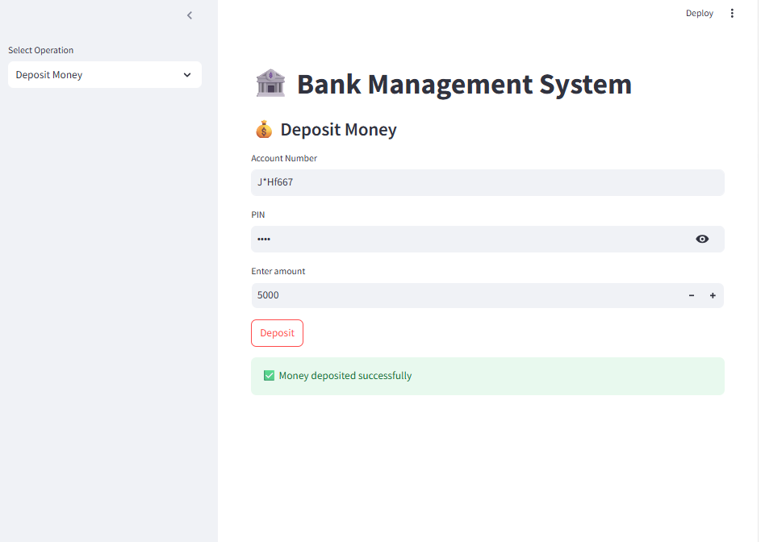

# streamlit-bank-app

This is a simple banking application built using Streamlit. In this project, users can create their own bank account, deposit money, withdraw money, and check their account details.

The main goal of this project is to understand how a basic banking system works and how we can build interactive web apps using Streamlit. Instead of using a database, I used a JSON file to store the data, which makes it easy to understand for beginners.

## Project Demo Screenshots

### Home Page


### Create Account Page


### Deposit Money


### Withdraw Money


### Account Details


> You can replace these images with your own screenshots by saving them inside an `images` folder.

---

## Features

- Create a new bank account with basic details  
- Deposit money into your account  
- Withdraw money with balance checking  
- View account details and current balance  
- Data stored in JSON file (no database required)  
- Simple and easy-to-use interface  

---

## Technologies Used

- Python  
- Streamlit  
- JSON (for storing data)  

---

## How the Project Works

- When a user creates an account, the data is saved in a JSON file  
- Each account has unique details like name, account number, and balance  
- Deposit and withdrawal operations update the balance in the JSON file  
- Streamlit handles the frontend and user interaction  
- The app reads and writes data in real-time  

---

## Why I Made This Project

I made this project to practice Python and learn how to build web apps using Streamlit. It also helped me understand file handling and how data can be managed without using a database.

---

## Future Improvements

- Add login and authentication system  
- Add transaction history feature  
- Improve UI design with better layout  
- Use a database like SQLite or MySQL  
- Add multiple user support  

---

## How to Run the Project

1. Clone the repository

Here’s a **more detailed but still simple, natural (human-written style)** README for your project. I also added **image placeholders** where you can put your screenshots easily.

You can copy this directly 👇

```markdown
# streamlit-bank-app

This is a simple banking application built using Streamlit. In this project, users can create their own bank account, deposit money, withdraw money, and check their account details.

The main goal of this project is to understand how a basic banking system works and how we can build interactive web apps using Streamlit. Instead of using a database, I used a JSON file to store the data, which makes it easy to understand for beginners.

---

## Project Demo Screenshots

### Home Page


### Create Account Page


### Deposit Money


### Withdraw Money


### Account Details


> You can replace these images with your own screenshots by saving them inside an `images` folder.

---

## Features

- Create a new bank account with basic details  
- Deposit money into your account  
- Withdraw money with balance checking  
- View account details and current balance  
- Data stored in JSON file (no database required)  
- Simple and easy-to-use interface  

---

## Technologies Used

- Python  
- Streamlit  
- JSON (for storing data)  

---

## How the Project Works

- When a user creates an account, the data is saved in a JSON file  
- Each account has unique details like name, account number, and balance  
- Deposit and withdrawal operations update the balance in the JSON file  
- Streamlit handles the frontend and user interaction  
- The app reads and writes data in real-time  

---

## Why I Made This Project

I made this project to practice Python and learn how to build web apps using Streamlit. It also helped me understand file handling and how data can be managed without using a database.

---

## Future Improvements

- Add login and authentication system  
- Add transaction history feature  
- Improve UI design with better layout  
- Use a database like SQLite or MySQL  
- Add multiple user support  


## How to Run the Project

1. Clone the repository  
```

git clone <your-repo-link>

```

2. Go to the project folder  
```

cd streamlit-bank-app

```

3. Install dependencies  
```

pip install streamlit

```

4. Run the app  
```

streamlit run app.py

```

---

## Project Structure

```

streamlit-bank-app/
│── app.py
│── data.json
│── images/
│   ├── home.png
│   ├── create_account.png
│   ├── deposit.png
│   ├── withdraw.png
│   └── account_details.png
│── README.md

```

---

## Author

Sourav Singh
```

If you want next step, I can:

* add **GitHub badges (stars, license, etc.)**
* or make it **placement-ready but still looks human-written** 👍
  
